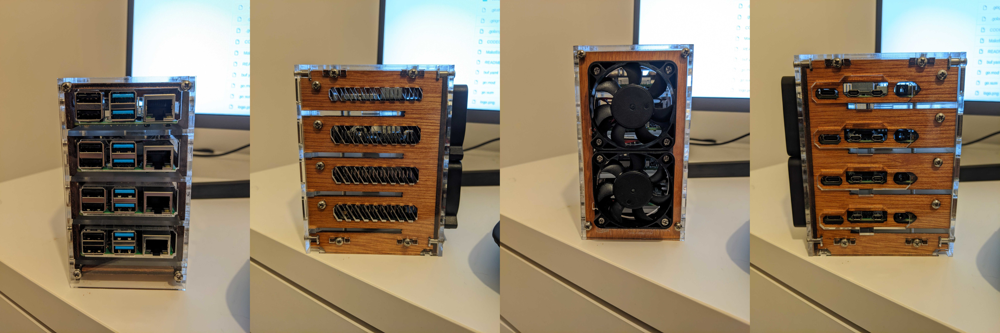

<!-- ToC start -->
# Table of Contents

   1. [Getting started](#getting-started)
   1. [Project structure](#project-structure)
   1. [Third party applications](#third-party-applications)
   1. [Prometheus exporters](#prometheus-exporters)
   1. [Other tools](#other-tools)
   1. [External services](#external-services)
   1. [Environment](#environment)
<!-- ToC end -->
# homelab  

Monorepo for my personal homelab. It contains applications and kubernetes manifests for deployment.

## Getting started

This assumes you have [go](https://golang.org/), [docker](https://www.docker.com/) & [make](https://www.gnu.org/software/make/manual/make.html) 
installed along with docker's [buildx](https://docs.docker.com/buildx/working-with-buildx/) plugin.

* Clone the repository
* Install golang tools using `make install-tools`
* Run `make` to build all binaries

## Project structure

* `cmd` - Entry points to any bespoke applications
* `internal` - Packages used throughout the application code
* `manifests` - Kubernetes manifests to run all my homelab applications
* `scripts` - Bash scripts for working within the repository.
* `vendor` - Vendored third-party code

## Third party applications

Here's a list of third-party applications I'm using alongside my custom applications:

* [deluge](https://deluge-torrent.org/) - For torrents
* [home-assistant](https://www.home-assistant.io/) - For interfacing with my ring cameras
* [pihole](https://pi-hole.net/) - For DNS and ad-blocking
* [traefik](https://traefik.io/) - For exposing services on the homelab, usually just their web-interfaces
* [prometheus](https://prometheus.io/) - For scraping all my metrics
* [grafana](https://grafana.com/) - For visualising all my metrics
* [jaeger](https://www.jaegertracing.io/) - For tracing my applications
* [node-exporter](https://github.com/prometheus/node_exporter) - For monitoring the host environment and exporting stats as prometheus metrics
* [helm](https://helm.sh/) - For installing non-trivial k8s applications, like the prometheus operator.
* [minio](https://min.io/) - An S3 compatible API that sits in front of my NAS drive.
* [postgres](https://www.postgresql.org/) - Relational SQL database

## Prometheus exporters

I've implemented several custom prometheus exporters in this repo that power my dashboards, these are:

* `coronavirus` - Exports UK coronavirus stats as prometheus metrics
* `homehub` - Exports statistics from my BT HomeHub as prometheus metrics
* `pihole` - Exports statistics from my pihole as prometheus metrics
* `speedtest` - Exports [speedtest](https://speedtest.net) results as prometheus metrics
* `weather` - Exports current weather data as prometheus metrics
* `worldping` - Exports world ping times for the local host as prometheus metrics
* `home-assistant` - Proxies prometheus metrics from a home-assistant server.
* `synology` - Exports statistics from my [Synology DS115j](https://www.amazon.co.uk/Synology-DS115j-1TB-Desktop-Unit/dp/B00O8LLQBY) NAS.

## Other tools

Here are other tools I've implemented for use in the cluster.

* `volume-backup` - Takes copies of my [persistent volumes](https://kubernetes.io/docs/concepts/storage/persistent-volumes/) and backs them up on my NAS drive via minio

## External services

These are devices/services that the cluster interacts with, without being directly installed in the cluster.

* [Ring](https://ring.com/) - Home security devices, connected via home-assistant
* [Tailscale](https://tailscale.com/) VPN - Used to access the cluster from anywhere
* [Synology](https://www.synology.com/) NAS - Used as the storage backend for minio, primarily used for volume backups

## Environment

* 4 [Raspberry Pi 4b](https://www.raspberrypi.org/products/raspberry-pi-4-model-b/) (8GB RAM)
* Kubernetes via [k3s](https://k3s.io/)
* [Zebra Bramble Cluster Case](https://www.c4labs.com/product/zebra-bramble-case-raspberry-pi-3-b-color-and-stack-options/) from [C4 Labs](https://www.c4labs.com/)

